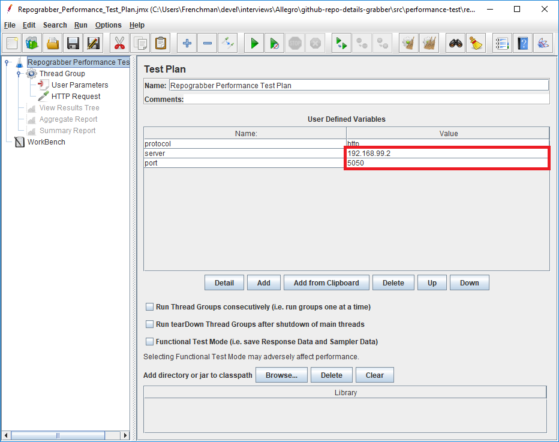

# GitHub Repograbber

Simple REST service returning details of given GitHub repository.

## Prerequisites

1. **[Maven][]** - to build and run the application (tested with version 3.3.9)
2. **[JMeter][]** - in order to execute performance tests (tested with version 3.3)
3. **[GitHub][] personal access token** with *public_repo* scope - follow instructions on [GitHub help](https://help.github.com/articles/creating-a-personal-access-token-for-the-command-line/ "Creating a personal access token")
4. **[Groovy 2.4][]** - used in performance tests by Spock framework
5. **[JDK 8][]**

## Installation and running the application

From the project root directory execute:

    $ mvn clean install
    $ java -jar -Dorg.frenchu.repograbber.github.security.user=username -Dorg.frenchu.repograbber.github.security.token=personaltoken target/repograbber-0.1.0-SNAPSHOT.jar

or

    $ mvn -Dorg.frenchu.repograbber.github.security.user=username -Dorg.frenchu.repograbber.github.security.token=personaltoken spring-boot:run 

Change `username` and `personaltoken` with your correct credentials obtained from GitHub, see [Prerequisites](#markdown-header-prerequisites) section.

Instead of `personaltoken` user account password can be used if you don't use two factor authentication. But it is **strongly discouraged** for security reasons.

By default server starts on port 5050. To change this behavior set `server.port` JVM command line `-D` argument/property to desired value.

Similarly, if you want enable request/response logging for the server set `logging.level.org.frenchu.repograbber` property to `DEBUG`. If you want to log also to file set `logging.file` property to destination file name/path.

Alternatively, you can put all your properties in the `application.properties` or `application.yml` file and place it in the project root directory or somewhere else in the classpath. Example configuration available to download: 

* [application.properties](doc/example_config/application.properties)
* [application.yml](doc/example_config/application.yml)

## Technology stack

### Ratpack

To face non-functional requirements regarding performance decision was made to use [Ratpack][] which is a simple and lean library for creating fast, async and non-blocking HTTP apps.

Ratpack was used for creating HTTP server and making REST API calls to GitHub via HttpClient. Moreover in integration tests TestHttpClient was used to test server itself.

### Spring Boot

[Spring Boot][] was used to support Ratpack HTTP server configuration. Ratpack provides `@EnableRatpack` annotation to simplify the process of configuration.

### Jackson

For generating and parsing JSON responses [Jackson][] library was used along with JSR310 data type module to support java.time API introduced in Java 8.

### Spock

To write end-to-end tests [Spock framework][] was chosen. Together with Groovy it helps defining concise and self-descriptive test specifications. 

## Testing

Application was provided with set of tests on different levels:

* unit tests
* component integration tests
* end-to-end integration tests
* performance tests

Additionally to different types of tests, checkstyle was incorporated into the project setup to meet code quality standards.

### Checkstyle

Checkstyle is run during maven build at verify phase.

To run the checks alone execute the command:

    $ mvn checkstyle:check

### Unit tests

Unit tests are run during maven build at test phase.

To run unit tests type:

    $ mvn test

### Component integration tests 

In component integration tests outside world is mocked and applications doesn't connect to any external resources. 

Component integration tests are run during maven build at integration-test phase.

To run component integration tests type:

    $ mvn verify

### End-to-end integration tests

In end-to-end tests the entire application is tested in a real-world scenario including network communication with GitHub.

End-to-end integration tests are run during maven build at integration-test phase.

To run end-to-end tests type:

    $ mvn verify

### Performance tests

As a performance tests framework [JMeter][] was used in the project. `Ropograbber_Performance_Test_Plan.jmx` resides in `src/performance-test/resources` directory.

You can open and tweak it using JMeter GUI (`jmeterw` executable in JMeter `bin` directory). You have to change host and/or port on the Test Plan screen and save the jmx file:

It is recommended to run test plan from command line using non-gui mode:

    $ jmeter -n -t project-localtion/src/performance-test/resources/Repograbber_Performance_Test_Plan.jmx -l log.jtl

#### Methodology and test results

The tests were performed on two machines. The first box acted like a server and the another one was a client running JMeter test plan.

**Server specification**:

* Intel(R) Core(TM) i7-6700, 3.4 GHz
* 32 GB RAM
* Windows 10 Pro, 64-bit
* SSD

**Client specification**:

* Intel(R) Core(TM) 2 Duo T5470, 1.6 GHz
* 4 GB RAM (3,99 GB available)
* Windows XP Professional, 32-bit

The test plan was tuned to use 20 threads with 5 loop counts and ramp-up time 200 ms (each thread starts running 10 ms later than the previous one). It gives 100 request in total in a one test run. Test plan was executed several times.

Test results: 

* [CSV format](doc/perf_tests/results.csv)
* [XLSX format](doc/perf_tests/results.xlsx)

The server is capable to run with rate ~25 requests per second. Most of the requests (99%) are processed in time less than 900 ms.

When trying to increase tests parameters (e.g. loop count) ConnectionTimeout error was observed in the server logs while heading GitHub REST API.

## Areas of improvement

### Authorization

There is no requirement for authorization in the task specification, therefore application API doesn't use any method of authorization. The assumption is that application is running in the safe internal network.

First step to improve the application is providing OAuth or at least Basic form of authorization.

### Response cache

In order to increase response time of the application key-value store (e.g. [Redis][]) can be used to keep already generated responses for given set of owner and repository path parameters. Before heading GitHub REST API the cache should be checked if it contains the repository details for requested owner and repository name. It is important to choose solution providing non-blocking API to leverage Ratpack library capabilities.

[GitHub]: https://github.com/ "GitHub homepage"
[Maven]: https://maven.apache.org "Maven homepage"
[JMeter]: https://jmeter.apache.org/ "JMeter homepage"
[Ratpack]: https://ratpack.io/manual/current/ "Ratpack documentation"
[Spring Boot]: https://projects.spring.io/spring-boot/ "Spring Boot project homepage"
[Jackson]: https://github.com/FasterXML/jackson "Jackson main repository"
[Spock framework]: http://spockframework.org/ "Spock framework homepage"
[Groovy 2.4]: http://groovy-lang.org/download.html "Groovy download page"
[JDK 8]: http://www.oracle.com/technetwork/java/javase/downloads/jdk8-downloads-2133151.html " Java SE Development Kit 8 download page"
[Redis]: https://redis.io/ "Redis homepage"
